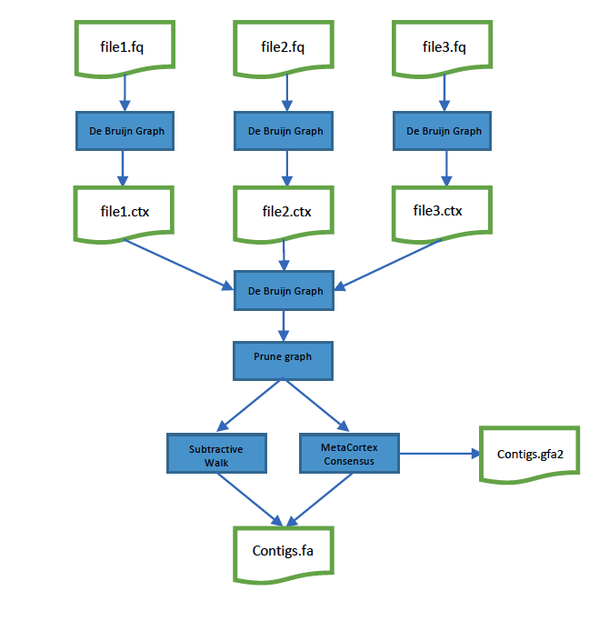

============
Introduction
============

MetaCortex is an assembler for metagenomic, or environmental sequence data. It is based onnthe consensus version of the Cortex assembler (cortex_con) developed by Mario Caccamo and Zamin Iqbal.

Key Concepts
============

CTX Files
---------

Though it is possible to go straight from FASTA or FASTQ files to a complete meta-assembly, MetaCortex (like Cortex) implements an intermediate binary file format which enables the parallelisation of the process of converting raw reads into a de Bruijn graph structure. As well as speeding up the overal assembly process by sharing out the reads across multiple processing cores, the approach also makes it possible to carru out big assemblies in lower memory environments.

Figure 1 illustrates the typical approach taken with MetaCortex, Reads are separated into files -0 either by hand, or beacuse the sequencing instrument has produced multiple files. MetaCortex is then executed in two stages: Firstly, in parallel, to import each reads file, create a de Bruijn graph and output a CTX file. Then secondly, to combine the separate CTX files and output contigs and sequence graphs.

Memory Usage
------------

MetaCortex uses a hash table structure to store kmer information and the de Bruijn graph structure. You do not need to understand exactly how this structure works in order to use MetaCortex, but you do need to tell MetaCortex how much memory to set aside for the hash table. There are two parameters you need to specify - the hash table width, :math:`n`, and the hash table height, :math:`b`. The size of the hash table (the number of kmers that can be stored) is then given by 
	.. math::
		s = 2^{n}b. 

This needs to be multiplied by the hash table entry size to find the total memory utilisation. The hash table entry size is 16 bytes for kmers of 31 nt or less, 24 bytes for kmers of 63 nt or less and 32 bytes for kmers of 95 nt or less. Table 1 provides some examples to illustrate how the :math:`n` and :math:`b` parameters relate to hash table size and memory usage.

+----+----+------------------+---------------+---------------+---------------+
| n  |  b | Capacity (kmers) | Memory        | Memory        | Memory        |
|    |    |                  | (k <= 31)     | (31 < k <= 63)| (63 < k <= 95)|
+====+====+==================+===============+===============+===============+
| 15 |100 | 3,276,800        | 50 Mb         | 75 Mb         | 100 Mb        |
+----+----+------------------+---------------+---------------+---------------+
| 20 |100 | 104,857,600      | 1.6 Gb        | 2.4 Gb        | 3.2 Gb        |
+----+----+------------------+---------------+---------------+---------------+
| 25 |100 | 3,355,443,200    | 51.2 Gb       | 76.8 Gb       | 102.4 Gb      |
+----+----+------------------+---------------+---------------+---------------+

Cleaning options
----------------

Cortex supports a number of cleaning options which are designed to remove kmers from the de Bruijn graph which are likely the result of errors. These options are included in MetaCortex too. However, it is recommended that in most metagenomic assembly situations, these are unused. More details can be found in the usage section.

Algorithms
==========

MetaCortex has several graph traversal algorithms, which are chosen depending on the output the user wants. In this section, we describe the three main traversal algorithms.

MetaCortex Consenus (MCC)
-------------------------

This is the default traversal algorithms, and can be used to create GFA and FASTG output alongside traditional FASTA output. For each node in the graph, the connected subgraph that contains this node is explored to find the node with largest coverage. From here, the graph is walked, taking the highest coverage branch in each case. The walk finishes when it reaches a tip, or the minimum coverage threshold is met. This path is written out as a contig to the fasta file.

If the ``-M`` option is specified, the nodes of this path are removed from the graph and the node traversal continues. If not, the whole connected subgraph that contained this path is removed, and the node traversal continues until all nodes have been visited.

Subtractive Walk (SW)
---------------------

This algorithm assumes that reads are sequenced using a shotgun metagenomic sequencing approach, without amplification. As in MCC, for each node in the graph, the connected subgraph that contains this node is explored to find the node with the largest coverage. However, to speed up the algorithm, there are limits to how many nodes will be explored. Then, as before, a path is found from the locally highest coverage node. This path is written out as a contig to the fasta file.

Next, MetaCortex estimates the number of variants covering each node in the path. This is done by finding the highest coverage node in the path, and walking out in either direction, maintaining a normalised value :math:`\delta_n`, representing the difference in coverage between two nodes. We assume that the node with highest coverage has one variant coverage, and 
	.. math::
		\delta_n = \frac{(v_n - v_{n+1})}{\text{max}(v_n, v_{n+1})}
		
where :math:`v_n` and :math:`v_{n+1}` are coverage values for two adjacent nodes in the path. Then, if the this value is above the threshold :math:`\delta_{\text{min}}`, set by the ``-W`` parameter, the current count of the number of covering variants is incremented. If it is below :math:`-\delta_{\text{min}}` then the current count of the number of covering variants is decremented.

Once the number of covering variants for each node in the path has been determined, those nodes with 1 covering variant are removed from the graph, and for all other nodes a value is subtracted from their coverage (keeping it positive). This value is determined by a linear interpolation from the two nearest 1-covering variant nodes. Then, the node traversal continues until all nodes with positive coverage have been visited.

Perfect Path
------------

This algorithm outputs "unitigs" - those paths in the de Bruijn graph where every inner vertex has in-degree one and out-degree one.